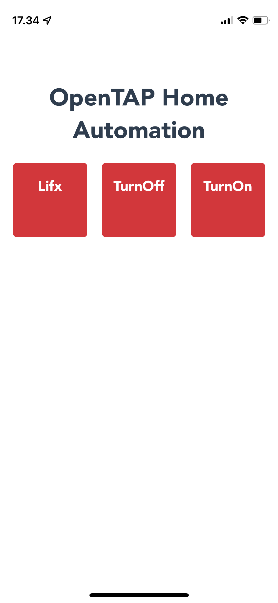

# OpenTAP Home Automation
Today is side project friday... So let's create a home automation system using OpenTAP.

We want to figure how we can extent OpenTAP to be used for automating the home and which downsides or benefits would be to it.

The vision for it is to create an easy way to design and execution the automation. 

### Initial Ideas
 - Controlling LIFX light bulbs
 - Scheduling actions with the light bulbs, such as turn off when it gets dark.
 - Design a system that can always be 'on'. For example a kind of service, mixed with "Resumable" test steps.
 - Add a WEB UI to control everything.

### Prerequisites
- LIFX Light Bulbs
- OpenTAP - https://opentap.io
- Servy - https://github.com/rolfrm/servy

## LIFX Light Bulb Control
LIFX is a WiFi connected smart light and they provide an easy to use HTTP WEB API with great [documentation](https://api.developer.lifx.com/docs).

### Authentication and Setup
From this documentation we can see we need to get a authentication token and use it when calling the API.

With C# it's pretty easy to setup a `HttpClient` with that token attached.

```cs
private static HttpClient client;
static void Init()
{
    client = new HttpClient();
    client.DefaultRequestHeaders.Authorization = new AuthenticationHeaderValue("Bearer", LifxSettings.Current.TOKEN);
    needInit = false;
}
```

This HttpClient can now be used to send request to the LIFX HTTP WEB API. We will use this to create method to control our lights.

### Finding our Available Lights
Before we can control our lights, we need to find them. LIFX has a simple endpoint to list all lights:

```cs
public static List<LifxLight> GetLights()
{
    if (needInit)
        Init();
    
    var data = client.GetStringAsync("https://api.lifx.com/v1/lights/all").Result;
    return JsonConvert.DeserializeObject<List<LifxLight>>(data);
}
```

### Sending Commands to the Lights
Now with a list of our lights, we can create methods that allow us to control them.

To turn on a light we need to provide the id of the light that need to change `/id:<the light id>/`. 

We also need to set which properties of the light need to change, in our case we want to change `power` to `off`. We can do this with form url encoded data (`x-www-form-urlencoded`).

```cs
public static void TurnOn(LifxLight light)
{
    var form = new List<KeyValuePair<string, string>>();
    form.Add(new KeyValuePair<string, string>("power", "on"));
    var content = new FormUrlEncodedContent(form);
    client.PutAsync($"https://api.lifx.com/v1/lights/id:{light.id}/state", content).Wait(1000);
}
```


### OpenTAP LIFX Settings
Since we now have a working API to control our LIFX light bulbs, we need a way to map the to OpenTAP.

We can create `ComponentSetting` that can store the details of the lights.

```cs
public class LifxSettings : ComponentSettings<LifxSettings>
{
    public List<LifxLight> Lights { get; set; } = new List<LifxLight>();

    [Display("Search for Devices")]
    [Browsable(true)]
    public void ScanForDevices()
    ...
}
```

We can also create method that can be called from a GUI that can search for light using our LIFX API and add them to this list.

Below we add a check if they already exists and ask if the user wants to add them:
```cs
[Display("Search for Devices")]
[Browsable(true)]
public void ScanForDevices()
{
    var lights = LifxApi.GetLights();
    
    foreach (var light in lights)
    {
        if (Lights.Any(d => d.uuid == light.uuid) == false)
        {
            var newDeviceRequest = new NewDeviceRequest()
            {
                Name = $"{light.label} {light.uuid}"
            };
            UserInput.Request(newDeviceRequest);
            
            if (newDeviceRequest.response == NewDeviceRequest.Response.Yes)
                Lights.Add(light);
        }
    }
}
```

Below is how it looks in the TUI:


### OpenTAP LIFX TestStep
In order for OpenTAP to control the lights, we can create a test step.

The step needs a way to select which light should be changed and how it should change. We can do this with a property and the `AvailableValues` attribute, this way the GUI will show a list available lights to control.

```cs
public class LifxStep : TestStep
{
    public List<LifxLight> AvailableLights => LifxSettings.Current.Lights;
    
    [AvailableValues(nameof(AvailableLights))]
    public LifxLight Light { get; set; }
}
```

The available values will show up in a GUI like this:


Now to select which change we want to make to the lights, we can create a enum with the possible actions we can run. This will function similarly as the `AvailableValues` attribute by automatically providing the available options:
```cs
public enum LifxAction
{
    TurnOn,
    TurnOff,
    ChangeBrightness,
    SetColor,
    SetTemperature
}
public LifxAction Action { get; set; }
```

With these options we just need to run the right API call in the TestStep `Run` method:
```cs
public override void Run()
{
    if (Light == null)
        UpgradeVerdict(Verdict.Inconclusive);

    try
    {
        switch (Action)
        {
            case LifxAction.TurnOn:
                LifxApi.TurnOn(Light);
                break;
            ...
        }
        
        UpgradeVerdict(Verdict.Pass);
    }
    catch
    {
        UpgradeVerdict(Verdict.Fail);
    }
}
```


## Scheduling Test Steps

In home automation it is often nice to be able to run automations triggered by certain events. For example, if you want to start an alarm and turn on the lights in the morning.

To fulfill this need we created a couple of different test steps:


### Schedule Step

A parent test step for all scheduling based steps. It is capable of running the child steps when a certain even occurs. Like the time of day. It runs the child steps in a separate thread so that multiple steps can be scheduled concurrently.

The design of the Schedule Step relies on the AllowChildrenOfType attribute, so that we can ensure that all child steps implements a specific test step:
```cs
[AllowChildrenOfType(typeof(ITimeTriggeredStep))] // only allow ITimeTriggeredStep as childsteps.
public class ScheduleStep : TestStep{
   ///...
}
```

The IScheduledStep is relative simple. All it does is telling the ScheduleStep when is the next time it was to execute.
```cs
/// <summary>
/// This kind of triggered event can calculate the time until it should be triggered to start the next time.
/// </summary>
public interface ITimeTriggeredStep : ITestStep
{
    /// <summary> How much time until triggering the event. </summary>
    TimeSpan TimeToTrigger { get; }
}
```

The Schedule Step does the following to figure which step to run next and then run it: 
```cs
var nextUp = ChildTestSteps
          // fetch all the test steps if this type.
         .OfType<ITimeTriggeredStep>()
          // order by the first to trigger next.
         .OrderBy(x => x.TimeToTrigger)
         // take the first one.
         .FirstOrDefault();
// wait until it is ready to execute.
TapThread.Sleep(nextUp.TimeToTrigger); 
// execute it asynchronously
TapThread.Start(() => this.RunChildStep(nextUp));
```

We have developed a few different test steps that implements the ITimeTriggeredStep.

### Time of Day Step
This test step will execute its child test steps at a specific time of the day. Multiple times can be selected each day.

### Interval Step
The interval step runs the child test steps every given time interval. For example, all child steps can be executed every 5 seconds.

### Sun-based Step
This test steps runs all child steps when the sun goes up or goes down. This can be useful if you want all lights to turn off when the sun rises.

### Future Scheduled Steps

In the future we might add test steps that are triggered by other events. Such as temperature changes, button clicks, web hooks. etc.

These should also be included for support in the Schedule Step.

## Create an OpenTAP TestPlan
With the TestStep ready we can start creating an OpenTAP TestPlan. Which allows us to do all kinds of cool stuff with the lights.

We have a few useful and fun ideas:
- We could turn on the lights when the sun sets.
- Lower the brightness of the lights in the evening, before bedtime.
- Or we could create a fun party mode with the light continuously changing colors.

**Turn on the lights when the sun sets:**


**Lower the brightness in the evening, before bedtime:**


**Sweep different colors going throught all imaginable colors of the lights:**


## Create a small WEB GUI
We can create a small web gui using an open-source web server called Servy.

### Servy
Servy is a small web server that maps http endpoints to cli calls. 

We can configure Servy to map two endpoints, one to get all test plans in the current directory and one to execute a test plan.

```yaml
#!servy
endpoints:
  getplans:
    call: dash -c "ls *TapPlan"
  runplan:
    call: dash -c "/usr/local/share/dotnet/dotnet tap.dll run $plan.TapPlan"  
host: http://192.168.163.178:8080
```

With these two endpoints we can create a test plan that turns on a specific light or turns it off. We can also create a plan that does multiple things, such as turning on multiple lights in one go.

### A Vue.js GUI
We can use vue.js to create a PWA (Persisted Web App), a web app that act almost as a native smartphone app. This web app can then call these endpoints and present them in a user friendly way.


**HTML Template:**

We create a small loop that shows all plans from a list of test plans.
```html
<template>
  <div class="grid">
    <div class="light" v-for="plan in testPlans" :key="plan" @click="runPlan(plan)">
      <h3>{{plan}}</h3>
    </div>
  </div>
</template>
```

**Code Behind:**

In vue we have a method called `mounted` that runs whenever the view is mounted. We can use this to call the `/getplans` endpoint, which list all available TestPlans.

We also create a method to run a specific TestPlan whenever the user clicks one of the TestPlans.
```js
<script lang="ts">
...
  public testPlans: string[] = [];

  async mounted(){
    // Get available test plans
    this.testPlans = await (await axios.get("/getplans")).data.split("\n").filter((p:string) => !!p).map((p:string) => p.substr(0, p.length - 8));
  }

  public async runPlan(plan: string){
    await axios.get("/runplan?plan=" + plan)
  }
}
</script>
```

### Final WEB UI Result

Aside from this code we have some styling, that we won't go into details about. But the end result is something like this:




